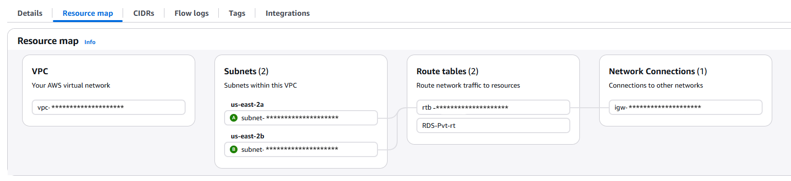

# CSCI4650 Final Project Dynamic Photo Hosting Website 
 Final Project for Intro to Cloud Computing course with an AWS website deployment package for a photo hosting website

## Getting Started
The first things you will need to ensure you have setup are an IAM profile with an Access Key and Secret Key, and a VPC with at least two subnets routed into an internet gateway to create the availability zone for the RDS database that will be deployed later on.

This is what the VPC Resource Map should look like to get started:

